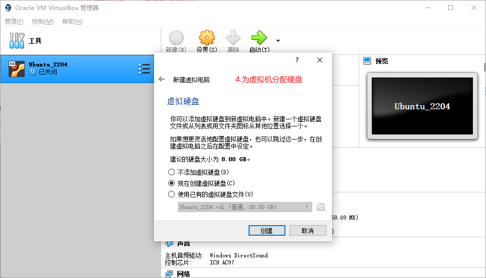
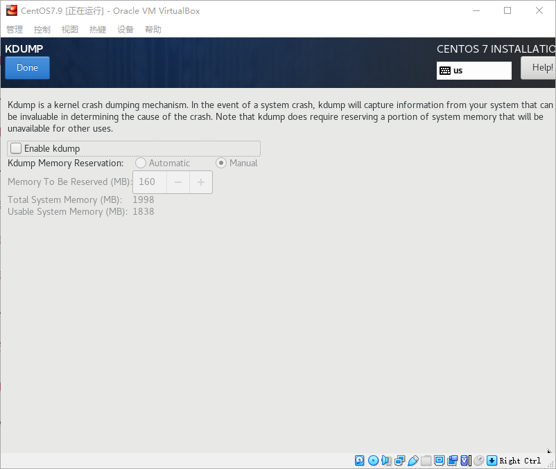

# Virtual Box 安装CentOS7.9

## 下载CentOS7.9镜像

阿里CentOS镜像下载地址：https://mirrors.aliyun.com/centos/7.9.2009/isos/x86_64/

## 配置host-only网卡

打开Virtual Box，选择“管理”，选择“网络管理器”

选择创建，会创建一个新的网卡

打开宿主机的网络设置，能够看到刚刚创建的网卡

这是一个host-only网络模式的网卡，为了宿主机能够通过xshell等ssh工具连接虚拟机

## 安装虚拟机

1. 选择新建虚拟机

2. 为虚拟机取一个名称，安装目录，选择系统版本。假如用系统名称命名，如CentOS，Virtual Box 会自动识别系统版本为Rad Hat

3. 分配内存

4. 分配虚拟硬盘

5. 选择虚拟硬盘文件类型

6. 选择动态分配

7. 分配硬盘大小和位置，选择创建

8. 分配CPU，可以根据宿主机的CPU数量斟酌分配

9. 设置网卡1，选择NAT模式，为了使虚拟机可以ping通宿主机和外网

10. 设置网卡2，选择刚刚创建的Host-Only网卡

11. 为虚拟机选择启动盘片，即刚刚下载的CentOS镜像

12. 选择启动，开始安装系统，选择 Install CnetOS 7

## 安装系统

进入CentOS安装界面

1. 选择安装语言

2. 选择时区

3. 选择硬盘分区

/boot 分区一般给1G足够，swap分区保持跟内存大小一致即可，其余分配只根分区/，根分区和/boot分区file system选择ext4，swap分区选择swap

KDUMP内存崩溃的转储机制，练习用的虚拟机可以关闭

启用两个网卡

设置root密码

设置完成后，等待安装完成即可